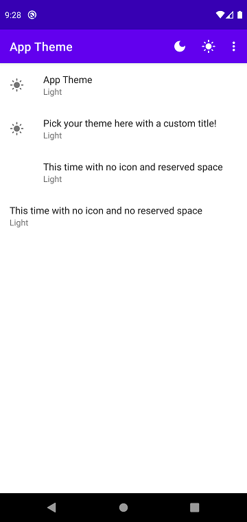
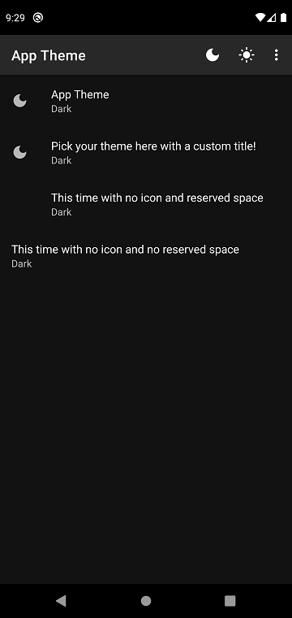

# AppTheme


[](https://jitpack.io/#jonapoul/apptheme)

## Summary
A simple library to hold logic for changing Android app theme between light, dark and system default. Includes a `Preference` class to allow changing inside your app, and an `AppTheme` class to allow manual updates and persistence.
 
## Gradle Import
Root-level `build.gradle`:
```gradle
allprojects {
    repositories {
        maven { url "https://jitpack.io" }
    }
}
```

Module-level `build.gradle`:
```gradle
dependencies {
    implementation "com.github.jonapoul:apptheme:1.0.0"
}
```

## Screenshots

| Light | Dark
|:--:|:--:|
 |  |

## Usage

### Basic

In your `Application` class's `onCreate` method, make sure to call:
```kotlin
AppTheme.init(this)
```
This ensures that the most recent theme is re-applied to the app.

### PreferenceScreen

Add a minimalist (read: using all defaults) entry to your settings XML file as below:
```xml
<com.jonapoul.theme.AppThemePreference />
```
That's it! This appears as the top-most entry on the above screenshots, containing a default preference title and a dynamically-updating icon. Don't worry about setting a preference key, any value you try to add via the `app:key` attribute will be overridden and ignored.

The class (at the moment) offers two customisation options:

| Name | Type | Default | Description |
|:--:|:--:|:--:|:--:|
| `atp_title` | `string` | App Theme | The emphasised string displayed inside the preference |
| `atp_shouldShowIcon` | `boolean` | true | If false, the dynamic icon is not shown, as in the 3rd and 4th entries in the above screenshots. |
| `iconSpaceReserved` | `boolean` | true | Setting this to true removes the gap on the left hand edge of the preference. Also removes the dynamic icon. |

### Programmatically

You can also update theme in code by calling the following method:
```kotlin
AppTheme.set(context, AppTheme.LIGHT)
```
The second argument can be one of `AppTheme.LIGHT`, `AppTheme.DARK` or `AppTheme.SYSTEM`. 

That's all she wrote.
